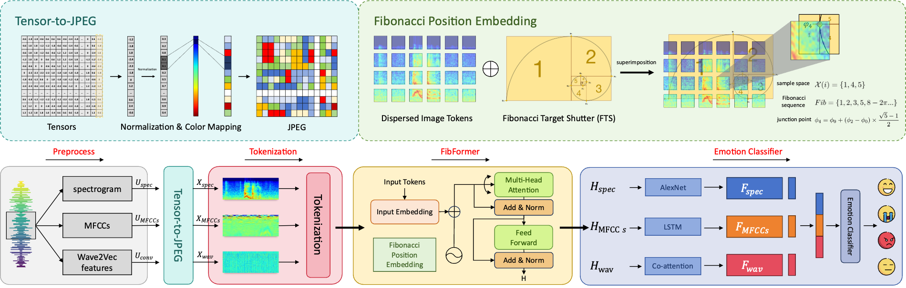

# FibFormer
The source code of FibFormer

## Structure

## Environment

CUDA Version: 12.2

Driver Version: 535.183.01

Description: Ubuntu 22.04.4 LTS

GPU: NVIDIA GeForce RTX 3090

## How to use

  1. Download the [pretrained Wav2vec2.0 model]( https://huggingface.co/facebook/wav2vec2-base-960h)
  2. Download the [processed data](https://pan.baidu.com/s/1yjgVgE_CCEMqa220OWMnWg?pwd=ar2b).

  3. Install related libraries. pip install requirements.txt
  4. Run python test_ratio.py

